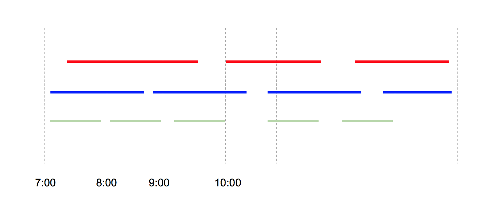
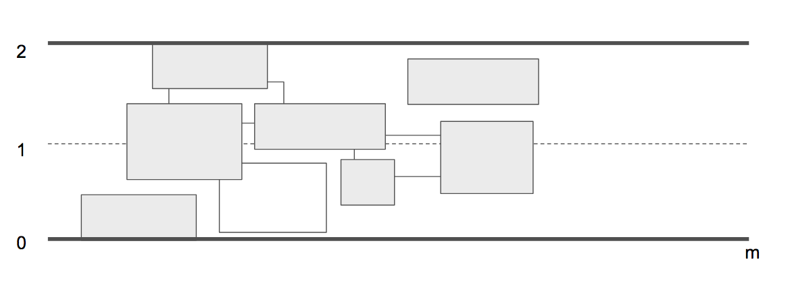

# Home Assignment 2
## Question 1: Application to Graph Search
You are given an undirected graph \(G=(V,E)\) where \(V\) is a list of cities and \(E\) is the road pattern between them. The road \(e=\{u,v\}\) connects city \(u\) and city \(v\), and you know its distance in kilometre \(l(e)\). You want to drive from city \(s\) to city \(t\). You own a small car which can only hold enough gas to cover \(Q\,\mathrm{km}\). There is a gas station in each city, but not between cities. Therefore, you can only take a route if every one of its edges has length at most \(Q\).

### Part 1
Describe an algorithm that given \(G,s,t\) and \(Q\), checks whether there is a feasible route from \(s\) to \(t\). Your algorithm should run in time \(O(V+E)\).

### Part 2
Modify Dijkstra's algorithm to, given \(G,s,t\), compute a path from \(s\) to \(t\) that minimizes the length of the longest edge on that path.

## Question 2: Negative Weights
In this problem, assume that you are given an access to a sub-routine \(\operatorname{Dijkstra}(V',E',w',s')\) which returns an array \(D\) such that, for each vertex \(v∈V'\), the length of a shortest path from \(s'\) to \(v\) is equal to \(D[v]\).

Assume that the running time of this sub-routine is always at most \(T(n,m)\) on \(n\)-vertex \(m\)-edge graph.

### Part 1
You are given an input directed graph \(G=(V,E)\), source \(s∈V\), and a weight function \(w\) for which there is exactly one edge \(e∈E\) with a negative weight. Assume that there is no negative cycle. Describe an algorithm that computes shortest paths from \(s\) to each vertex in \(V\) in time \(O(T(|V|,|E|))\).

### Part 2
You are given an input directed graph \(G=(V,E)\), source \(s∈V\), and a weight function \(w\) for which there are exactly \(k\) edges \(e∈E\) with negative weight. Assume that there is no negative cycle. Describe an algorithm that computes shortest paths from \(s\) to each vertex in \(V\) in time \(O(k+1)!(T(|V|,|E|))\).

## Question 3: Multiple Selection
We discussed the method of \(\operatorname{selection}\) using \(O(n)\) comparisons. Recall that \(\operatorname{selection}(A, k)\) takes as input an unsorted array \(A\) and returns the \(k\)-th smallest elements in \(A\).

Now, we are interested in doing multiple selection efficiently. Design an algorithm that takes array \(A\) together with integers \(1≤k_1≤k_2≤…≤k_m≤n\) and returns the \(k_i\)-th smallest elements for all \(i\). For instance, \(\operatorname{mult\_selection}(A, {1, n})\) is expected to return the minimum together with the maximum of elements in \(A\).

Describe an algorithm for multiple selection that runs in time \(O(n \log(m+1))\).

## Question 4: Dijkstra's Modification
Shortest paths are not always unique: sometimes there are two or more different paths with the minimum possible length. Show how to solve the following problem in \(O((V+E) \log E)\) time.

**Input**: An undirected graph \(G=(V,E)\); edge lengths \(l_e>0\); vertex \(s∈V\).

**Output**: A boolean array \(\operatorname{usp}[⋅]\) where, for each \(v∈V\) the value \(\operatorname{[V]}\) is true if and only if there is a unique shortest path from \(s\) to \(v\).

Modify Dijkstra's algorithm to solve this problem.

## Question 5: Lecture Hall Allocation
Aalto University receives multiple requests from professors to book meeting rooms on the upcoming Christmas Day 2018; professors like to work hard, and working on Christmas is a part of their enjoyment (professors are masochistic in nature -- and you could argue some may be sadistic).

There are \(k\) lecture halls in total and \(n\) Aalto professors. Each professor \(i\) makes a request of the form \([s_i,t_i]\) where \(s_i\) and \(t_i\) are the starting and ending tiem of their booking.

Describe an efficient algorithm that determines whether the \(k\) lecture halls are enough to serve the requests by professors. If they are enough, your algorithm should produce the list of requests to be scheduled in each room. If now, the algorithm can simply output NO.

Please see below a sample input where \(k=3\) lecture halls are enough to serve the requests:

## Question 6: Label Placement
You are given a collection of \(n\) rectangles (represented by the coordinates of their four corners) that lie in the strip of height \(2\) and length \(m\). Each rectangle has a height between \([1/3, 1]\) and can be arbitrarily long. See the image below.

Design an algorithm efficiently finds the maximum subset of rectangles that do not overlap. More formally, each rectangle is represented by the point set \([a,b]×[c,d]\), and two rectangles overlap if and only if their interiors have non-empty intersection.

## Question 7: Smooth Non-decrasing Subsequence
For a sequence of non-negative real numbers \(a_1,a_2,…,a_n\), we say that a subsequence \(a_1,a_2,…,a_{i_k}\) where \(i_1 < i_2 < … < i_k\) is non-decresing subsequence of length if \(a_{i_j}≤a_{i_{j+1}}\) for all \(1≤j < k\). Further, we say that such a subsequence is \(B\)-smooth if we have \(a_{i_{j+1}}-a_{i_j}≤B\) for all \(1≤j< k\).

Describe a dynamic programming algorithm that takes as input the sequence \(a_1,…,a_n\) together with integer \(B\) and produces the longest \(B\)-smooth non-decreasing subsequence (i.e. find the one with maximum \(k\)). To receive full credits, clearly, define the DP table as well as the recurrence. Briefly analyze the running time of your algorithm.

## Question 8: Catching Ameet's Mistake?
Ameet proposed the following algorithm and claimed that the algorithm solves Minimum Spanning Trees (MST) problem. He bets 100 EUR that his algorithm would be correct. Would you bet against him? Either prove that he is correct to give a counterexample showing that he is not.

\(\operatorname{Ameet-MST}(G,w)\)

1) Sort the edges into a non-increasing order of edge weights \(w\)
2) \(T=E\)
3) For each edge \(e∈E\), taken in non-increasing order of weights
    4) if \(T-e\) is a connected graph, then remove \(e\) form \(T\)

## Question 9: Application of Data Structures
Given \(k\) sorted arrays \(A_1,A_2,…,A_k\) as input, devise an algorithm that merges arrays into one sorted array \(A\) that combines elements from all such \(A_i\). You algorithm should run in time \(O(n\log(k+1))\) where \(n\) is the total number of elements in the combined array \(A\).

## Question 10: Minimum Spanning Trees with Updates
You are given graph \(G=(V,E)\), weight function \(w\) on edges, together with a subtree \(T\) of \(G\) that is guaranteed to be a minimum spanning tree.

Describe a deterministic algorithm that, given an additional edge \(e\) (not in \(G\)) iwth cost \(w(e)\), find a minimum spanning tree \(T'\) for \(G'=(V,E∪\{e\})\) in \(O(|V|+|E|)\).

Notice that your algorithm should not try to recompute MST from scratch but should instead use information about \(T\).
