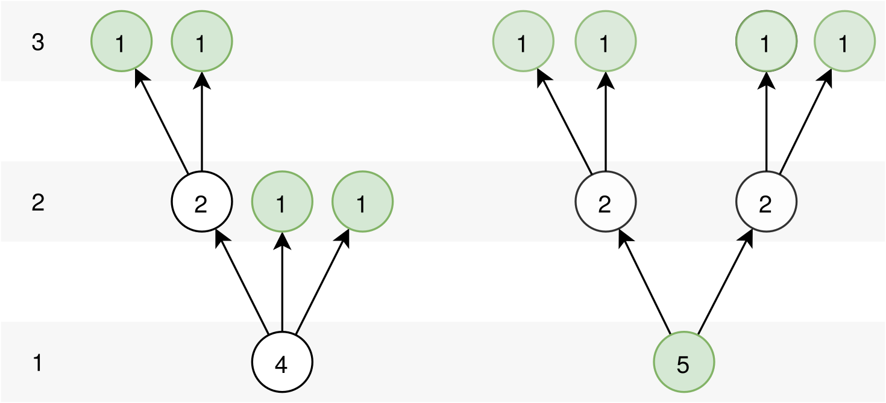

## 1.1 Independent Set on Trees

The subproblem for the independent set on tree problem is given as [@algorithms_book, ch. 6.7]

\[
I(u) = \text{size of largest independent set of subtree hanging from } u
\]

The recursive formula

\begin{equation}
I(u) = \max \left\{1+\sum_{\text{grandchildren } w \text{ of } u} I(w), \sum_{\text{chilren } w \text{ of } u} I(w)\right\}.
\label{largest-subtree}
\tag{largest-subtree}
\end{equation}

If vertex \(u\) has no chilren and therefore no grandchildren then \(I(u)=1\) because the sums in the formula have value \(0\). This means that all leaf vertices belong to the independent set. For  non-leaf vertices, only those vertices whose none of their chilren belong to the independent set, belong to the independent set. The figure \ref{fig1} visualizes this.

The linear time nature \(O(|V|+|E|)\) of the algorithm stems from its resemblense to graph search algorithms like DFS and BFS. By starting the recursion from the root vertex, the recursion will continue until the top of the tree is reached, then it will start folding back and computing the value for the function \(\eqref{largest-subtree}\). The algorithm can also be modified to mark whether it belongs to the independent set or not by the rules mentioned above. The independent set can then be reconstructed by collecting all the marked vertices.

## 1.2 Mr. Trump's Study Planning
Given a set of courses \(\{1,…,n\}\) let \(S=\{c_1,…,c_n\}\) be a set where \(c_i∈ℕ\) is a positive integer denoting the credits avarded from a particular course. The penalty incurred per semester is defined \(p(x)=(30-x)^2,\) where \(x\) is the amount of credits received from that semester.

---

An algorithm that will determine whether there is a way to complete the degree with zero penalty works as follows:

1) Add elements to sum \(x = c_1 + c_2 + ... + c_i\) until:

    a) The penalty \(p(x)\) of the sum equals to zero (checks every time when new element is added). Then from step 1, start adding elements to a new sum starting from element \(c_{i+1}\) and repeat the loop.

    b) Run out of elements. If the penalty of the sum doesn't equal to zero there is no way to complete the degree with zero penalty. If it does equal to zero there is a way to complete the degree with zero penalty.

---

Let the penalty of a set of elements be the penalty of the sum of its elements \[p(S') = p(\operatorname{sum}(S')).\]

The objective is to find a partition of the set \(S = S_1 ∪ S_2 ∪ … ∪ S_k\) such that the sum of the penalties of the sets is minimized

\begin{equation}
\min_{S_1, S_2, ..., S_k} p(S_1) + p(S_2) + ... + p(S_k).
\end{equation}

In this case, the partitions case must be disjoint and the elements in the paritions consecutive, i.e. the set \(S_1\) contains the elements \(c_1,c_2,…,c_{i_1}\) then set \(S_2\) contains the elements \(c_{i_1},c_{i_1+1}…,c_{i_2}\) and so forth. The problem can solved using dynamic programming approach similar to rod cutting [@introduction_to_algorithms, ch. 15.1]. The solution start with the recursive definition of the minimization

\begin{equation}
\begin{aligned}
r(S) = \min(p(S),
r(\{s_1\}) + r(\{s_2,...s_n\}), \\
r(\{s_1,s_2\}) + r(\{s_2,...s_n\}),..., \\
r(\{s_1,...,s_{n-1}\}) + r(\{s_n\}))
\end{aligned}
\end{equation}

TODO: ...

<!-- \(p(\operatorname{sum}(S_i)) + p(\operatorname{sum}(S_{i+1}))\) vs \(p(\operatorname{sum}(S_i∪S_{i+1}))\) -->

## 1.3 Nidia & Candies, Revisited
Given a set of candies \(S=\{c_1,…,c_m\}\) where \(c_i∈ℕ\) is a positive integer denoting the calories in a particular candy and \(C=\operatorname{sum}(S)\) denotes the total amount of calories in all candies, divide candies between *two people* such that each one receives equal amount of calories. This means finding two *disjoint subsets* \(S'⊂S\) and \(S''⊂S\) such that their sums are equal \[\operatorname{sum}(S') = \operatorname{sum}(S'').\]

### Part 1
If all candies are divided, the two subsets are  \(S'⊂S\) and \(S''=S-S'\) then the sum equality becomes \[\operatorname{sum}(S') = \operatorname{sum}(S'') = C/2.\] Therefore the algorithm needs to only find a subset \(S'\) whose sum equal to a constant, \(C/2\) in this case. This problem is know as the [subset sum problem](https://en.wikipedia.org/wiki/Subset_sum_problem) which can be reduced to the *knapsack without repetition problem*. This can be done by setting the knapsack capacity to the constant and then checking if the obtained solution equals to the constant. [@algorithms_book, pg. 257 & ch. 6.4]

The knapsack problem is formulated such that \(K(w,j)\) is the maximum value achievable using a knapsack of capacity \(w\) and items \(1,...,j\). Then the recursive formula

\[
K(w, j) = \max\{K(w-w_j, j-1)+v_j, K(w, j-1)\}.
\]

By setting the maximum capacity \(W=C/2\), weight of the items \(w_i=c_i\) and the values of the item \(v_i=c_i\) then solving \(K(w, j)\) and comparing it to \(C/2\). The algorithm has the same runtime as knapsack. \(O(nW)\), where \(n\) is the amount of items in the knapsack. In this case we have \[O(mC/2) = O(mC)\]

### Part 2
- TODO: use the algorithm above
- TODO: choose a set \(S'\) then try to find \(S''\) such that \(\operatorname{sum}(S'') = \operatorname{sum}(S')\). Think \(\operatorname{sum}(S')\) as constant.

## 2.1 Verification Problem
Given a flow network \(G=(V,E)\) with source \(s\), sink \(t\), capacity \(c\) and flow \(f\), according to the *max-flow min-cut theorem*, the flow \(f\) is maximal if the residual network \(G_f\) contains no augmenting paths. [@introduction_to_algorithms, ch. 26]

The *residual capacity* is defined by

\[
c_f(u,v) =
\begin{cases}
c(u,v) - f(u,v) & (u,v)∈E, \\
f(v,u) & (v,u)∈E, \\
0 & \text{otherwise.}
\end{cases}
\tag{residual-capacity}
\label{residual-capacity}
\]

The residual network \(G_f=(V,E_f)\) induces by \(f\) where

\[
E_f = \{(u,v)∈V×V:c_f(u,v)>0\}.
\tag{residual-edges}
\label{residual-edges}
\]

The number of residual edges is bounded by \(|E_f|≤2|E|.\)

An *augmenting path* \(p\) is a simple path from \(s\) to \(t\) in the residual network \(G_f\). It determines how much the flow can be increased on this path. If no augmenting paths exists, the flow \(f\) cannot be increased.

<!-- \[
c_f(p) = \min\{c_f(u,v):(u,v) \text{ is on } p\}
\] -->

The algorithm consists of two steps:

1) Construct the residual network \(G_f\) which requires constructing the edges \(E_f\). Combining equations \(\eqref{residual-capacity}\) and \(\eqref{residual-edges}\) an efficient algorithm can construct the edges in \(O(|E|)\) time.

2) Find a path from the source \(s\) to the sink \(t\) in \(G_f=(V,E_f)\). If a path is found algorithms reports `NO` and if path is not found it report `YES`. This can be done using a graph search such as DFS or BFS which run in time \(O(|V|+|E_f|)=O(|V|+|E|).\)

The combined runtime of the algorithms is \(O(|V|+|E|).\)

## 2.2 Uncrossing Minimum Cuts
The *capacity* of the cut \((S,T)\) is
\[
c(S,T) = \sum_{u∈S}\sum_{v∈T} c(u,v)
\]

A *minimum cut* of a network is a cut whose capacity is minimum over all cuts of the network.

- properties of capacity? \(c(u,v)=c(v,u)\)?
- properties of sum?
- TODO: try using net flow over the cut? Flow can be negated f = sum1 - sum2 -> -f = sum2 - sum1

Let \((S,T)\) and \((S',T')\) be two minimum cuts in graph \(G\). Then ...

\[
c(S,T) = c(S',T')
\]

<!-- ---

\[
S = (S∩S')∪(S∩T') \\
T = (T∩T')∪(S'∩T)
\] -->

---

A, B, C, and D are disjoint, capacity

\[
c(A∪B, C∪D) = c(A∪D, B∪C) \\
c(A,C) + c(A,D) + c(B,C) + c(B,D) = c(A,B) + c(A,C) + c(D,B) + c(D,C)
\]

...

\[
c(A, B∪C∪D) = c(A∪B∪D, C)
\]

## 2.3 Unique Minimum Cuts
An algorithm that determines if a minimum cut \((S,T)\) on a flow network is unique by iterating over the edges in the cut \(E'=(u,v)\) where \(u∈S\) and \(v∈T\), increasing the capacity of this edge temporarily and then computing the new maximum flow. If there exists an edge \(E'\) where the maximum flow was not increased then the minimum cut is not unique. This is because increasing the capacity of an single edge in the cut increases the capacity of the cut and if the cut is unique the maximum flow will increase for all edges \(E'\). [@unique_min_cut]

## 2.4 Maximum Flow with Updates
Given a flow network \(G=(V,E)\) with source \(s\), sink \(t\), capacity \(c\) and flow \(f\) and corresponding residual network \(G_f\). If capacity \(c(u,v)\) for edge \((u,v)∈E\) is increased by one, the corresponding capacity of the residul network \(c_f(u,v)\) also increases by one according to \(\eqref{residual-capacity}\). If the previous residual capacity for this edge was \(0\), then it means that there is a new edge in the residual network given by \(\eqref{residual-edges}\) and therefore new augmenting path \(p\). Find the new augmenting path using graph search like DFS and BFS and augment the flow in the path \(p\) to update the flow to the new maximum. The graph search has runtime \(O(|V|+|E_f|)=O(|V|+|E|)\) and the augmentation depends on the length of the path \(p\) which is limited by the number of edges in the residual graph \(O(|E_f|)=O(|E|)\) and therefore the runtime of the whole algorithm is \(O(|V|+|E|).\) [@introduction_to_algorithms, ch. 26]

## 3.2 Wanchote Runs a Business
The parameters

- A set of items \(I=\{1,…,n\}\).
- A set of customers \(C=\{1,…,m\}\).
- Each customer \(i∈C\) has a budget \(B_i∈ℝ_+\) (positive real number).

Each item has a price determined by the price function \[p:I→ℝ_+.\]

Since each customer is only interested in buying the whole subset of items, i.e. all items \(1,…,n\), the total price of the set is the variable that needs to be determined. It is defined as

\begin{equation}
q=\sum_{i∈I} p(i).
\end{equation}

---

If the prices must make every customer happy, i.e, every customer must be able to affort the whole set of item, the prices \(p\) must be set such that the total price of the set of items \(q\) is equal to the smallest budget

\begin{equation}
q=\min_{i∈C} B_i.
\end{equation}

---

The profits of the sales depend on the number of customer who can affort the set of items \(B_i≥q\) and the price of the set of items \(q\). In order to maximize the profits ...

\begin{equation}
\max_{q∈B} q ⋅ |\{B_i≥q ∣ i∈C\}|
\end{equation}

where \(B\) is a set of all budgets. An algorithm that would first sort the set of all budgets can be formulated to have complexity of \(O(|B|\log|B|)\).

TODO: linear program \(q ⋅ i\) ... ?

---

A trivial example of where the profit is \(1000\) times higher when optimizing for profits instead of making customers happy. For example, if we have budgets \(B=\{1, 2000\}\) then by trying to make all customers happy the price is set to \(1\) and the profit will be \(2⋅1=2\). On the other hand if the price is set to \(2000\) only one of the customer will be able to affort but the profit will be \(1⋅2000=2000\).

## References
