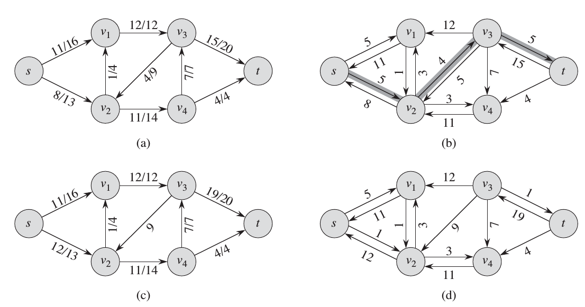
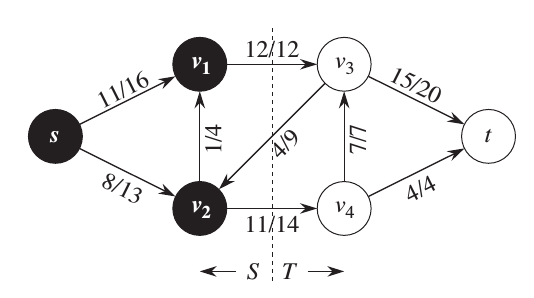
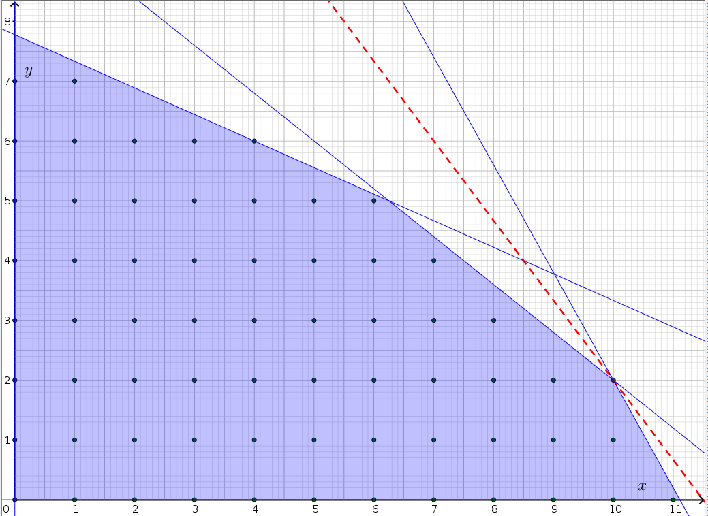

# Maximum Flow

A **flow network** \(G=(V,E)\) is a directed graph.

1) Each edge has **capacity** \(c(u,v)≥0\).
2) Two special vertices: **source** \(s\) and **sink** \(t\).

A **flow** is a function \(f:V×V→ℝ\) that has two properties:

1) **Capacity constraint**: For all \(u,v∈V\) \[0≤f(u,v)≤c(u,v)\]
2) **Flow constraint**: For all \(u∈V-\{s,t\}\) \[∑_{v∈V}f(v,u)=∑_{v∈V}f(u,v)\]

**Maximum flow** is a flow \(f\) with maximum **value** \[|f|=∑_{v⁠∈V}f(s,v)-∑_{v∈V}f(v,s).\]

**Residual network** \(G_f=(V,E_f)\) where \[E_f = \{(u,v)∈V×V : c_f(u,v)>0\}\] and **residual capacity**
\[
c_f(u,v) =
\begin{cases}
c(u,v) - f(u,v) & (u,v)∈E, \\
f(v,u) & (v,u)∈E, \\
0 & \text{otherwise.}
\end{cases}
\]

An **augmenting path** \(p\) is a simple path from \(s\) to \(t\) in the residual network \(G_f\). The residual capacity of path \(p\) is \[c_f(p)=\min\{c_f(u,v):(u,v) \text{ is on } p\}.\]

A **cut** \((S,T)\)  of flow network \(G\) is a partition of \(V\) into \(S\) and \(T=V-S\) such that \(s∈S\) and \(t∈T\).

A **minimum cut** of a network is a cut whose **capacity**  \[c(S,T)=∑_{u∈S}∑_{v∈T}c(u,v)\] is minimum over all cuts of the network.

**Max-flow Min-cut Theorem**

1) \(f\) is a maximum flow in \(G\).
2) The residul network \(G_f\) contains no augmenting paths.
3) \(|f|=c(S,T)\) for some cut \((S,T)\) of \(G\).

\(\operatorname{Ford-Fulkerson}(G,s,t)\)

1) Set \(f(u,v)=0\) for all \((u,v)∈E\)
2) **while** there exists a path \(p\) from \(s\) to \(t\) in the residual network \(G_f\)
3) ___ **for** each edge \((u,v)∈p\)
4) ___ ___ **if** \((u,v)∈E\)
5) ___ ___ ___ \(f(u,v) = f(u,v) + c_f(p)\)
6) ___ ___ **else** \(f(v,u) = f(v,u) - c_f(p)\)

# Dynamic Programming
Steps for developing dynamic programming algorithm:

1) Characterize the optimal substructure.
2) Recursively define the value of an optimal solution.
3) Compute the value of the optimal solution, typically in a bottom-up fashion.
4) Construct an optimal solution from computed information.

Elements of dynamic programming:

1) **Optimal substructure**: An optimal solution contains within it optimal solutions to subproblems.
2) **Overlapping subproblems**: The recursive algorithm revisits the same problems repeatedly.

**Subproblem graph**: Embodies information on how subproblems depend on one another.

---

*Longest increasing subsequence*:

1) \(L(j)\) is the distance of the longest increasing subsequence upto \(j\)
2) \(L(j) = 1 + \max\{L(i) : (i,j)∈E\}\)

*Knapsack*

1) \(K(w,j)\) is maximum values achievable using a knapsack of capacity \(w\) and items \(1,...,j\).
2) \(K(w,j)=\max\{K(w-w_j, j-1)+v_j, K(w, j-1)\}\)

*Independent sets on trees*

1) \(I(u)\) is the size of largest independent set of subtree handing from \(u\)
2) \(I(u) = \max\left\{1+∑_{\text{grandchildren } w \text{ of } u}I(w), ∑_{\text{children } w \text{ of } u}I(w)\right\}\)

# Linear Programming

**Standard form**: Maximize the **value** of the **objective function** given set of **constraints**

\[
\begin{aligned}
\text{maximize} & 𝐜^T𝐱 \\
\text{subject to } & A𝐱≤𝐛 \\
& 𝐱≥0
\end{aligned}
\]

- **Feasible solution**: The variables \(𝐱\) that satisfy the constraints
- **Feasible region**: convex region consisting formed by the set of feasible solutions
<!-- - **simplex**: feasible region formed by the intersections  -->
- **Integer linear programming**: The values \(𝐱\) are constrained to integer values \(ℕ\). NP-hard!
- **Simplex algorithm**: principle?

---

*Single source shortest path*: Given weighted directed graph \(G=(V,E)\), with weight function \(w:E→ℝ\), a source vertex \(s\), and destionation vertex \(t\).
\[
\begin{aligned}
\text{maximize} & d_t \\
\text{subject to} & d_v ≤ d_u + w(u,v) \text{ for each edge } (u,v)∈E \\
& d_s = 0.
\end{aligned}
\]

*Maximum flow* can be formulated as a linear program:
\[
\begin{aligned}
\text{maximize} & ∑_{v⁠∈V}f(s,v)-∑_{v∈V}f(v,s) \\
\text{subject to} & f_{uv} ≤ c(u,v) & \text{ for each edge } u,v∈V, \\
& ∑_{v∈V}f_{vu} = ∑_{v∈V}f_{uv}, & \text{ for each } u∈V-\{s,t\} \\
& f_{uv} ≥ 0 & \text{ for each edge } u,v∈V.
\end{aligned}
\]

# NP and Reductions
